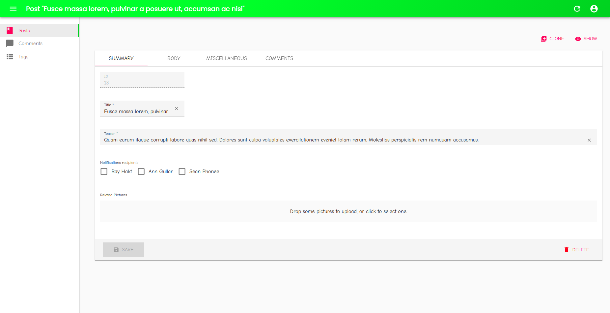

# React-admin Tutorial - Changing The Look And Feel Of React-Admin Without JSX

<table>
    <tr>
        <td></td>
        <td>
            <strong>Archived Repository</strong>
            <br />
            The code of this repository was written to illustrate the blog post <a href="https://marmelab.com/blog/2020/09/01/react-admin-tutorials-build-your-own-theme.html">Changing The Look And Feel Of React-Admin Without JSX</a>
            <br />
            This code is <strong>not intended to be used in production</strong>, and is <strong>not maintained.</strong>
        </td>
    </tr>
</table>



## How to run

If you're running this app standalone:

```sh
# install dependencies
yarn
# run the app in watch mode (reloads when a change is detected in the app code)
yarn dev
```

If you're in the react-admin repository:

```sh
# install the dependencies for the monorepo
make install
# run the app in extended watch mode (reloads when a change is detected in the app code and in the packages code)
make run-simple
```

And then browse to [http://localhost:8080/](http://localhost:8080/).

The credentials are **login/password**
